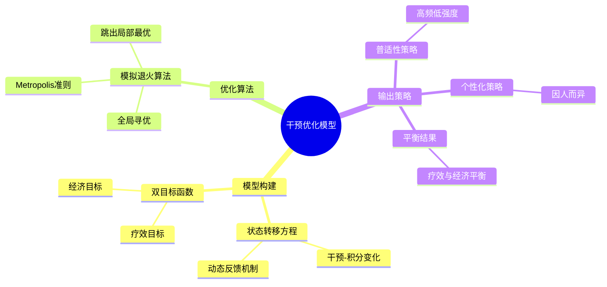

# 干预优化模型思维导图

## 简化版思维导图（Mermaid格式）



## 文字版简化思维导图

```
                    干预优化模型
                         |
        +----------------+----------------+
        |                |                |
    模型构建          优化算法          输出策略
        |                |                |
    +---+---+        +---+---+        +---+---+
    |       |        |       |        |       |
状态转移  双目标   模拟退火  Metropolis  普适性  个性化
方程     函数     全局寻优    准则      策略    策略
    |       |                           |       |
干预-积分  疗效+                      高频低强度 因人而异
动态反馈  经济                            |
                                    疗效与经济平衡
```

## 核心流程

1. **模型构建阶段**
   - 建立状态转移方程
   - 描述"干预-积分变化"的动态反馈
   - 确立双目标函数（疗效 + 经济）

2. **优化求解阶段**
   - 采用模拟退火算法进行全局寻优
   - 通过Metropolis准则避免陷入局部最优

3. **策略输出阶段**
   - 生成普适性策略：高频低强度
   - 生成个性化策略：针对个体特征
   - 实现疗效与经济的平衡

## 关键特点

- **动态反馈**：实时调整干预策略
- **双目标优化**：同时考虑疗效和成本
- **全局最优**：避免局部最优解
- **个性化**：兼顾普适性和个性化需求
