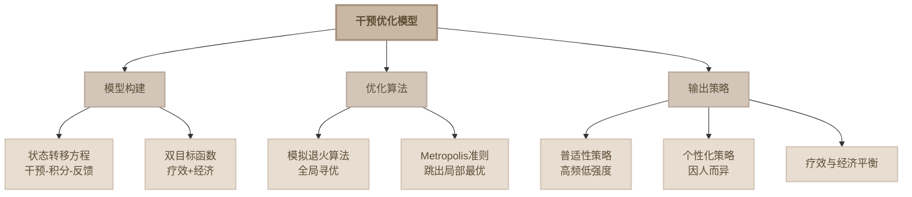

# 干预优化模型思维导图

## 简化版思维导图（Mermaid格式 - 莫兰蒂配色）



## 紧凑型文字版思维导图

```
                      ┌─────────────┐
                      │ 干预优化模型 │
                      └──────┬──────┘
                             │
              ┌──────────────┼──────────────┐
              │              │              │
         ┌────┴────┐    ┌────┴────┐    ┌────┴────┐
         │模型构建  │    │优化算法  │    │输出策略  │
         └────┬────┘    └────┬────┘    └────┬────┘
              │              │              │
        ┌─────┴─────┐   ┌────┴────┐   ┌────┼────┐
        │           │   │         │   │    │    │
    ┌───┴──┐    ┌───┴──┐ │      ┌──┴──┐ │ │  ┌──┴──┐
    │状态  │    │双目标│ │      │Metr-│ │ │  │个性化│
    │转移  │    │函数  │ │      │opol-│ │ │  │策略  │
    │方程  │    │疗效+ │ │      │is   │ │ │  │     │
    │干预- │    │经济  │ │      │准则 │ │ │  └─────┘
    │积分  │    └─────┘ │      └─────┘ │ │
    └─────┘            │              │ │
                   ┌───┴───┐      ┌───┴──┐
                   │模拟退火│      │普适性│
                   │全局寻优│      │高频低│
                   └───────┘      │强度  │
                                 └──┬───┘
                                    │
                               ┌────┴────┐
                               │疗效经济  │
                               │平衡结果  │
                               └─────────┘
```

## 核心流程

1. **模型构建阶段**
   - 建立状态转移方程
   - 描述"干预-积分变化"的动态反馈
   - 确立双目标函数（疗效 + 经济）

2. **优化求解阶段**
   - 采用模拟退火算法进行全局寻优
   - 通过Metropolis准则避免陷入局部最优

3. **策略输出阶段**
   - 生成普适性策略：高频低强度
   - 生成个性化策略：针对个体特征
   - 实现疗效与经济的平衡

## 关键特点

- **动态反馈**：实时调整干预策略
- **双目标优化**：同时考虑疗效和成本
- **全局最优**：避免局部最优解
- **个性化**：兼顾普适性和个性化需求
